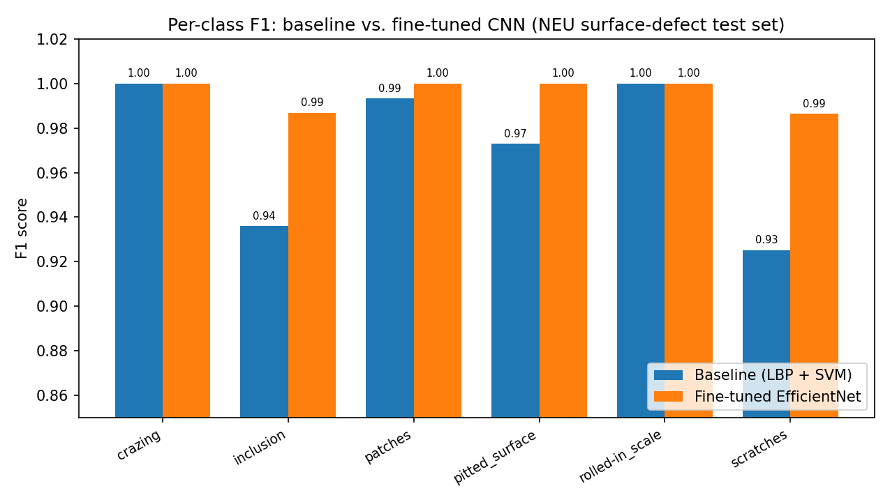

# Surface Defect Inspector

Automated visual quality inspection for metal-surface manufacturing: a classical texture
baseline (Local Binary Patterns + SVM) shown side by side with a fine-tuned **EfficientNet**, on
the **NEU steel-surface defect benchmark**. The deep model has to earn its complexity by beating a
real, measured baseline, not an assumed one.

Six defect types: **crazing, inclusion, patches, pitted surface, rolled-in scale, scratches**.

Built for the Swiss precision-manufacturing / MedTech context, where automated optical inspection
of surfaces and components is a real production problem.

## Why this exists

Every "we used a CNN" project should be able to answer one question: is it actually better than
the boring, cheap classical method? Surface-defect classification is a *texture* problem, and
Local Binary Patterns + an SVM is the canonical, decades-old approach — so it's a genuinely fair
yardstick, not a strawman. This project measures the gap directly: same data, same held-out split,
baseline vs. fine-tuned EfficientNet, reported honestly (including per-class, where a transformer-
style model tends to earn its keep on the hardest-to-separate classes).

Same "honest, measured, verified" pattern as the rest of this portfolio: the classical baseline
is the yardstick (like the TF-IDF baseline in news-topic-classifier or the greedy heuristic in
bedding-franchise-erp), and the interesting result is *how much* the deep model beats it.

## The dataset

[NEU surface-defect database](https://www.kaggle.com/datasets/kaustubhdikshit/neu-surface-defect-database)
(Northeastern University) — 1,800 grayscale images (200×200), 300 per class, six defect types of
hot-rolled steel strip. A standard, widely-used industrial-inspection benchmark.

## How the two models are built — and the constraint behind it

The environment this was built in has no GPU and can't reach the dataset host, so — exactly like
the transformer in this portfolio's news-topic-classifier — the deep model is fine-tuned in a
self-contained **Colab notebook** (`notebooks/finetune_efficientnet_neu.ipynb`) on the *same* real
data and the *same* fixed train/test split the local code uses, then exported and dropped back in.

**The key design choice — and the upgrade over news-topic-classifier:** the fine-tuned EfficientNet
is exported to **ONNX** and served with the lightweight `onnxruntime`. An EfficientNet-B0 is ~20 MB
(vs. a 255 MB DistilBERT), so it commits to the repo and — crucially — the *deep* model runs **live
on a free-tier host**, not just locally. There is **no PyTorch in the deployed service at all**; the
whole thing (baseline + CNN) serves from `onnxruntime` + `scikit-learn` + `scikit-image`.

Until the two trained artifacts are present in `models/`, the service degrades gracefully and reports
each model as not loaded, rather than crashing — same honesty contract as the rest of this portfolio.

```json
{ "baseline_loaded": true, "deep_loaded": false,
  "deep_status": "No ONNX model found at .../models/model.onnx. Run the notebook and copy model.onnx here." }
```

## Measured results

Both models evaluated on the **same** held-out test split (450 images, 25%, seed 42);
EfficientNet fine-tuned for 8 epochs on a T4 GPU.

| Metric | Baseline (LBP+SVM) | Fine-tuned EfficientNet | Delta |
|---|---|---|---|
| Accuracy | 97.1% | 99.6% | +2.4pp |
| Macro F1 | 0.971 | 0.996 | +0.024 |

| Defect type | Baseline F1 | EfficientNet F1 | Delta |
|---|---|---|---|
| crazing | 1.000 | 1.000 | — |
| inclusion | 0.936 | 0.987 | +0.051 |
| patches | 0.993 | 1.000 | +0.007 |
| pitted_surface | 0.973 | 1.000 | +0.027 |
| rolled-in_scale | 1.000 | 1.000 | — |
| scratches | 0.925 | 0.987 | +0.062 |



The honest headline is that the **classical baseline is already very strong** — LBP+SVM hits 97.1%,
because surface defects really are a texture problem and LBP is genuinely good at texture. That's
what makes the comparison worth doing: the fine-tuned CNN still improves on it (to 99.6%), and it
does so *exactly where the baseline is weakest*. The baseline's two lowest classes are **scratches
(0.925)** and **inclusion (0.936)** — and its confusion matrix shows why: it mixes the two up (7 of
75 scratches are misread as inclusions). Those are precisely the two classes where EfficientNet earns
its biggest gains (+0.062 and +0.051), pushing four of the six classes to a perfect F1. A transformer-
/CNN-style model earning its keep on the hardest-to-separate classes, not spreading its improvement
evenly, is the expected and honest pattern (the same thing happened on Business/Sci-Tech in this
portfolio's news-topic-classifier).

`scripts/evaluate.py` reproduces this comparison from the real data + `models/model.onnx`, logs it to
MLflow, and also writes both confusion matrices under `docs/`.

## Running it

```bash
pip install -r requirements.txt
uvicorn app.main:app --reload
```

Open `http://localhost:8000/` for the landing page (upload a surface image, see both models
classify it) or `http://localhost:8000/docs` for the API. The service boots with no torch and a
small memory footprint; both models load from `models/` if present, and it degrades gracefully if
not.

To produce the trained artifacts:

1. Open `notebooks/finetune_efficientnet_neu.ipynb` in Google Colab, set a **T4 GPU** runtime, and
   Run all. It downloads NEU, fine-tunes EfficientNet, trains the baseline on the same split, prints
   the honest comparison, and downloads `model.onnx` + `baseline_lbp_svm.joblib` + `results_summary.json`.
2. Drop `model.onnx` and `baseline_lbp_svm.joblib` into `models/`.
3. Restart the service — both models now serve live.

### API

| Endpoint | Description |
|---|---|
| `GET /` | Landing page with an upload-and-classify demo |
| `GET /health` | Which models are loaded |
| `GET /classes` | The six defect types |
| `GET /baseline/metrics` | Measured baseline accuracy / macro F1 / per-class F1 / confusion matrix |
| `POST /predict` | multipart image upload → baseline + deep predictions |

### Tests

```bash
pytest tests/ -v
```

Real training on real (synthetic, generated on the fly) images — no mocks. Covers: the LBP feature
extractor, the baseline training + prediction, the ONNX inference path (against a tiny committed
fixture model, so CI needs no torch and no 20 MB download), and the API's loaded and
graceful-degradation paths.

### Experiment tracking (MLflow)

Once the real data and `models/model.onnx` are in place, `scripts/evaluate.py` independently
reproduces the comparison — it re-splits the data, retrains the baseline, runs the ONNX CNN over the
same test set, logs both models' metrics to MLflow, and saves the comparison chart + both confusion
matrices as artifacts:

```bash
pip install -r requirements-eval.txt          # mlflow + matplotlib (still no torch)
python scripts/evaluate.py --data-dir data/NEU-CLS
mlflow ui --backend-store-uri sqlite:///mlflow.db
```

Same local-SQLite MLflow pattern as swiss-claims-assistant, bedding-franchise-erp, and
news-topic-classifier.

### CI

GitHub Actions runs the test suite on every push/PR to `main` (`.github/workflows/ci.yml`),
installing the OpenCV system lib and running `pytest` — no torch, no dataset download needed.

### Docker

```bash
docker build -t surface-defect-inspector .
docker run -p 8000:8000 surface-defect-inspector
```

(Shell-form `CMD` respects a platform-assigned `$PORT`. Written and structurally checked; not run
in the build sandbox, which has no Docker daemon.)

### Live demo

Deployed on Render's free tier: **[link added once deployed]**. Because the deep model is served via
ONNX (not PyTorch), **both** models run live here — upload a surface image and see the classical and
the fine-tuned CNN predictions side by side. The free tier spins down after 15 min idle, so the
first request after a lull takes ~30–50s to wake.

## What I'd do next

- Extend from defect **classification** to defect **localization** (bounding boxes / segmentation),
  which is what a real inline-inspection line needs.
- Add a calibrated "uncertain — route to human" band for low-confidence predictions, the way a real
  QC station would escalate rather than force a call.
- Quantize the ONNX model to int8 for even faster CPU inference on the free tier.
